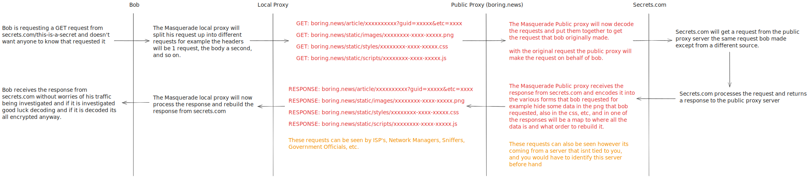

# 🎭 Masquerade Proxy

A stealthy HTTP proxy designed to conceal HTTP activity and disguise it as mundane traffic through steganography, encryption, and polymorphism. -- Crafted for masking HTTP activity as regular "uninteresting" traffic to mislead analysts, ISPs, sniffers, network loggers, and more. 

## What is "masquerade proxy"?

A masquerade proxy is a concept designed to disguise your requests as something "boring" by using techniques like steganography. This makes it harder for "spies"—such as ISPs, government entities, sniffers, or network managers—to identify or monitor your traffic.

Additionally, a key purpose of a masquerade proxy is to conceal its very nature as a proxy. By appearing as legitimate, non-proxy traffic, it reduces the likelihood of being detected or blocked by network administrators or automated filters.

 

<picture>
  <source media="(prefers-color-scheme: dark)" srcset="docs/traffic-diagram@dark.svg">
  <source media="(prefers-color-scheme: light)" srcset="docs/traffic-diagram@light.svg">
  
</picture>

## How does the steganography work?

<picture>
  <source media="(prefers-color-scheme: dark)" srcset="docs/steganography-diagram@dark.svg">
  <source media="(prefers-color-scheme: light)" srcset="docs/steganography-diagram@light.svg">
  
</picture>
