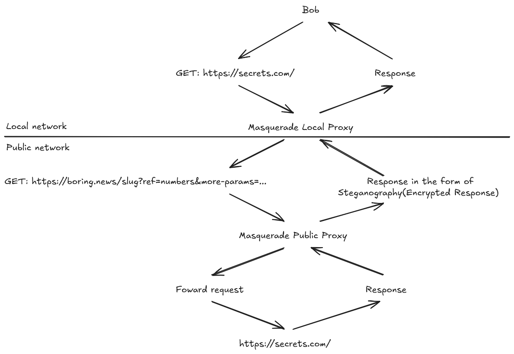

# 🎭 Masquerade Proxy

A stealthy HTTP proxy designed to conceal HTTP activity and disguise it as mundane traffic through steganography, encryption, and polymorphism. -- Crafted for masking HTTP activity as regular "uninteresting" traffic to mislead analysts, ISPs, sniffers, network loggers, and more. 

  
Network diagram. 

   
  
  

